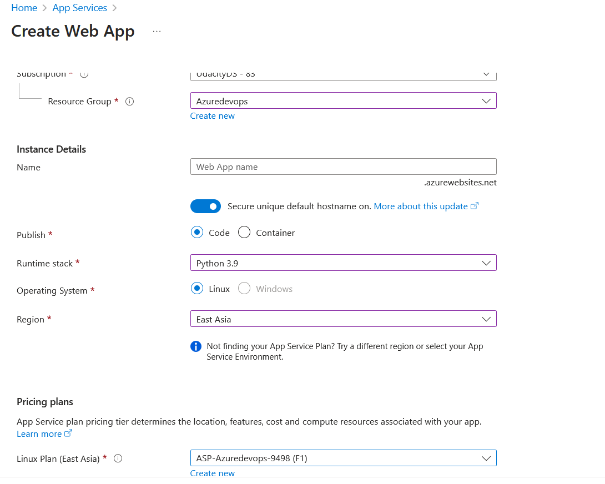
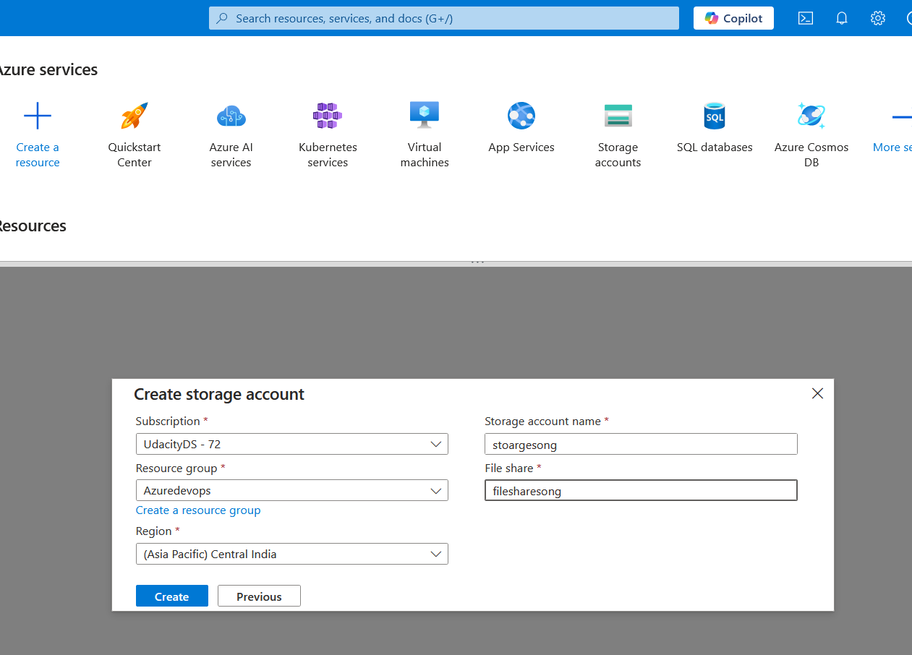
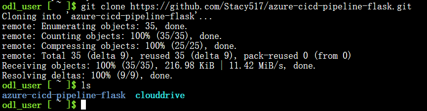
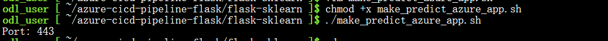
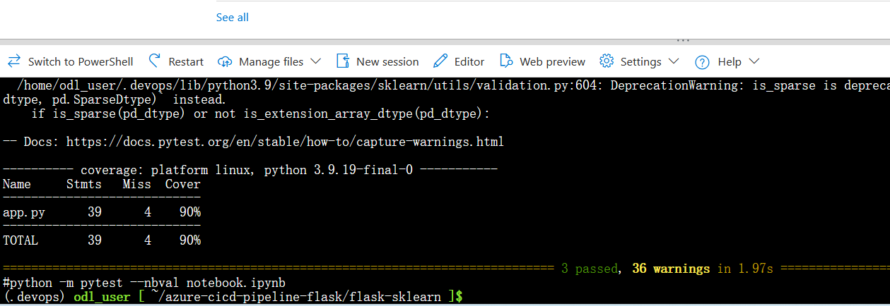
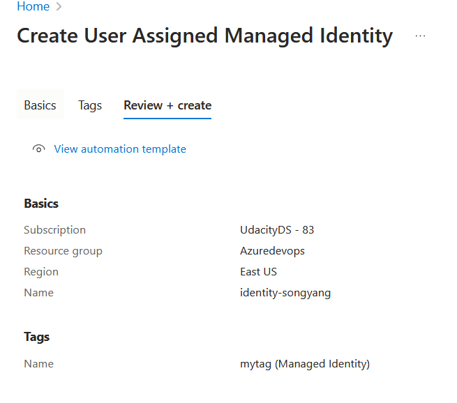

# Overview

This project is a machine learning microservice for house price prediction using Flask and Scikit-learn, deployed with Azure CI/CD pipelines.

## Project Plan
<TODO: Project Plan

* A link to a Trello board for the project
* A link to a spreadsheet that includes the original and final project plan>

## Instructions

<TODO:  
* Architectural Diagram (Shows how key parts of the system work)>

<TODO:  Instructions for running the Python project.  How could a user with no context run this project without asking you for any help.  Include screenshots with explicit steps to create that work. Be sure to at least include the following screenshots:

# Create a web app
Go to Azure protal, click app service, then create a app service named songyang
Set up the app service:
Using the exsiting resource group
Set the Runtime stack as python 3.9 
Set the Pricing plan as Free F1 # very important


# Setup Azure Cloud Shell and clone the project
Setup Azure Cloud Shell



* clone the project in Azure Cloud Shell
git clone https://github.com/Stacy517/azure-cicd-pipeline-flask.git


* Go to the project directory
cd azure-cicd-pipeline-flask/flask-sklearn

* Create a python virtual environment
python3 -m venv ~/.devops
source ~/.devops/bin/activate

# Project running on Azure App Service
chmod +x make_predict_azure_app.sh
./make_predict_azure_app.sh



# Run initial setup
make all

* Passing tests that are displayed after running the `make all` command from the `Makefile`


[](https://github.com/Stacy517/azure-cicd-pipeline-flask/actions/workflows/myapp.yml)

# Setup Azure Pipelines
<!-- * First, create a managed identity for the app service
Because we create the app service as free F1, we need to create a user assigned  identity for the app service.


* Assign the managed identity to the app service
Go to the app service, click settings > identity, click user assigned, then assign the managed identity to the app service.

* Add role assignment to the managed identity
Click the Access control (IAM) in the left menu, click Add > Add role assignment
choose the role as Website contributor, go next, then choose the managed identity, select the user assigned identity you created, then click assign -->

<!-- Go to the exsiting resource group, click the Access control (IAM) in the left menu, click Add > Add role assignment. Choose the role as Managed Identity Contributor, go next, then choose the managed identity, select the user assigned identity you created, then click assign. If you don't do this step, you will get the error message: "The identity does not have access to perform action blabla". -->

<!-- * Finally, you can setup the deployment center for the app service
Go to the app service, click settings > deployment center, then choose the source as GitHub, login your Github account, then choose the repository and branch you want to deploy, choose the user-assigned identity you created, then click save -->

* Setup the deployment center of the app service
Go to the app service, click settings > deployment center, then choose the source as GitHub, change the provider as "Building with Azure Pipelines". 

* Setup the Azure pipeline
Go to  Azure DevOps portal, click Pipelines > New pipeline, then choose the GitHub as the source, then choose the repository and branch you want to deploy.
Choose the exsiting Azure Pipeline YAML file. 


# Configure self-hosted agents
In the last step, you may get the error message:No hosted parallelism has been purchased or granted. To request a free parallelism grant, please fill out the following form https://aka.ms/azpipelines-parallelism-request

You can request a free parallelism grant or configure a self-hosted agent by this following steps:
* create a VM
az vm create \
--name DevOpsAgentVM \
--resource-group Azuredevops \
--image Ubuntu2204 \
--size Standard_B1s \
--admin-username azureuser \
--generate-ssh-keys \
--public-ip-address-dns-name devops-agent-sg
* login to the VM
ssh azureuser@<vm_ip_address>

* install the dependencies
sudo apt update && sudo apt upgrade -y
sudo apt install -y curl gnupg2 software-properties-common unzip
sudo apt install -y python3 python3-pip

* download the agent 
mkdir myagent && cd myagent
wget https://vstsagentpackage.azureedge.net/agent/3.242.0/vsts-agent-linux-x64-3.242.0.tar.gz
tar zxvf vsts-agent-linux-x64-3.242.0.tar.gz

* run the agent
./config.sh --unattended \
--url https://dev.azure.com/{your_org_name} \  
--auth pat \
--token {你的PAT} \ 
--pool Default \
--agent devops-vm-agent \
--replace \
--acceptTeeEula

* Setup the pipeline

* Output of a test run

* Successful deploy of the project in Azure Pipelines.  


* Running Azure App Service from Azure Pipelines automatic deployment

* Successful prediction from deployed flask app in Azure Cloud Shell.  


The output should look similar to this:

```bash
udacity@Azure:~$ ./make_predict_azure_app.sh
Port: 443
{"prediction":[20.35373177134412]}
```

* Output of streamed log files from deployed application

> 

## Enhancements

<TODO: A short description of how to improve the project in the future>

## Demo 

<TODO: Add link Screencast on YouTube>


